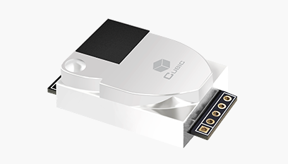

CUBIC CM1106 Single Beam NDIR CO2 Sensor Module
===============================================

.. seo::
    :description: Instructions for setting up CM1106 CO2 sensors
    :image: cm1106.png
    :keywords: cm1106, DAIKIN BRY88AB151K, BRY88AB151K

The ``cm1106`` sensor platform allows you to use CM1106 CO2 sensors with ESPHome.

    CUBIC CM1106 Single Beam NDIR CO2 Sensor Module.

Communication with the CM1106 sensor is done via UART, so you need to define a 
:ref:`UART bus <uart>` in your configuration. Connect the ``rx_pin`` to the TX pin of the CM1106 
and the ``tx_pin`` to the RX pin of the CM1106 (note that the TX/RX labels are from the sensor’s 
perspective). Additionally, set the baud rate to 9600 for proper communication.

.. code-block:: yaml

    # Example configuration entry
    sensor:
      - platform: cm1106
        co2:
          name: CM1106 CO2 Value

Configuration variables:
------------------------

- **co2** (*Optional*): The CO2 data from the sensor in parts per million (ppm).
  All options from :ref:`Sensor <config-sensor>`.

- **update_interval** (*Optional*, :ref:`config-time`): The interval to check the
  sensor. Defaults to ``60s``.

- **uart_id** (*Optional*, :ref:`config-id`): Manually specify the ID of the :ref:`UART Component <uart>` if you want
  to use multiple UART buses.

- **id** (*Optional*, :ref:`config-id`): Manually specify the ID used for actions.

.. _cm1106-calibrate_zero_action:

``cm1106.calibrate_zero`` Action
--------------------------------

This :ref:`action <config-action>` executes zero point calibration command on the sensor with the given ID.

To perform zero-point calibration, the CM1106 sensor must operate in a stable 400ppm CO₂ environment for
at least 20 minutes before executing this function.

.. code-block:: yaml

    on_...:
      then:
        - cm1106.calibrate_zero: my_cm1106_id

You can provide an :ref:`action <api-device-actions>` to perform from Home Assistant

.. code-block:: yaml

    api:
      actions:
        - action: cm1106_calibrate_zero
          then:
            - cm1106.calibrate_zero: my_cm1106_id

Examples:

Button to start the calibration process:

.. code-block:: yaml

    button:
      - platform: template
        name: "CM1106 Calibration"
        entity_category: diagnostic
        on_press:
          then:
            - cm1106.calibrate_zero: my_cm1106_id

Pseudo-automatic calibration by CO2 value:

.. code-block:: yaml

    binary_sensor:
      - platform: template
        id: co2_calibration
        lambda: |-
          if (id(co2sensor).state < 400) {
            return true;
          } else {
            return false;
          }
        filters:
          - delayed_on: 15min
        on_press:
          then:
            - cm1106.calibrate_zero: my_cm1106_id
        internal: true

See Also
--------

- :ref:`sensor-filters`
- :apiref:`cm1106/cm1106.h`
- :ghedit:`Edit`
