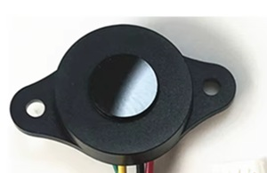

GL-R01 I²C - Time Of Flight Mini LiDAR Laser Ranging Sensor
===========================================================

The ``GL-R01 I²C`` sensor platform allows you to use your GL-R01 I²C
Time Of Flight Mini LiDAR Laser Ranging sensor with ESPHome.

The time-of-flight principle is based on the speed of the light. An emitter sends 
photons which are reflected by the target and detected by the receiver 
(called SPAD for Single Photon Avalanche Diode). The time difference between 
the emission and the reception provides the actual distance of the target in millimeters
with a high accuracy.

GL-R01 is sold in three versions - IIC (I²C), UART Automatic and UART Controlled (Modbus). 
This integration supports only IIC (I²C) version at the moment.
The :ref:`I²C <i2c>` is required to be set up in your configuration for this sensor to work.

    GL-R01 I²C - Time Of Flight Mini LiDAR Laser Ranging Sensor

.. code-block:: yaml

    sensor:
      - platform: gl_r01_i2c
        name: "ToF"

Configuration variables:
------------------------

- **update_interval** (*Optional*, :ref:`config-time`): The interval to trigger measurement and update sensor.

- All other options from :ref:`Sensor <config-sensor>`.

I²C Configuration variables:

- **address** (*Optional*, int): Manually specify the I²C address of
  the sensor. Defaults to ``0x74``. If unsure, check I²C scan logs and adjust address by its output.

- **i2c_id** (*Optional*): Manually specify the I²C bus ID. Only needed if multiple buses are used.

See Also
--------

- :ref:`sensor-filters`
- :ref:`I2C bus <i2c>`
- :apiref:`gl_r01_i2c/gl_r01_i2c.h`
- :apiref:`gl_r01_i2c/gl_r01_i2c.cpp`
- :ghedit:`Edit`
