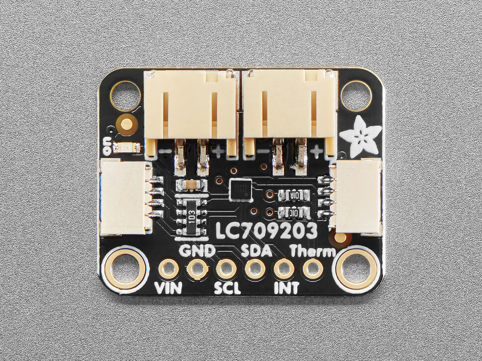
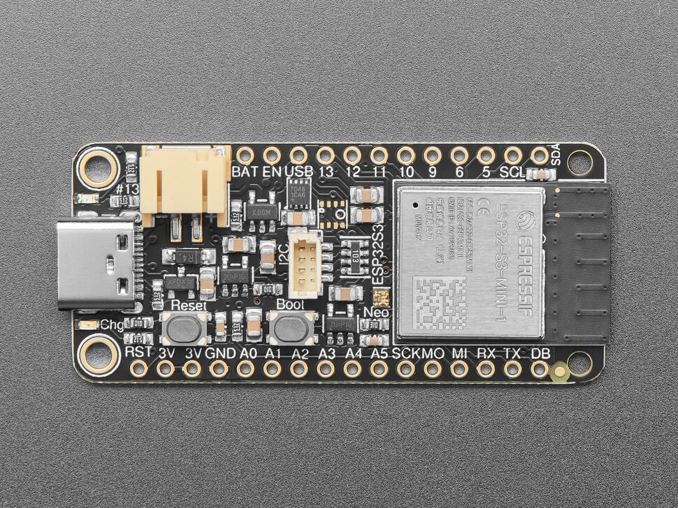
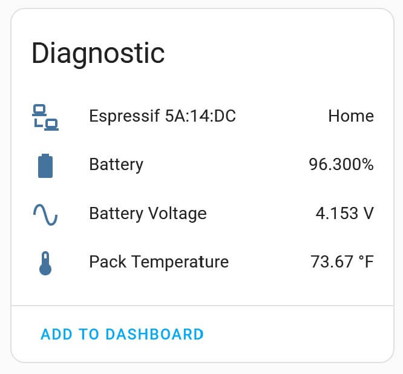
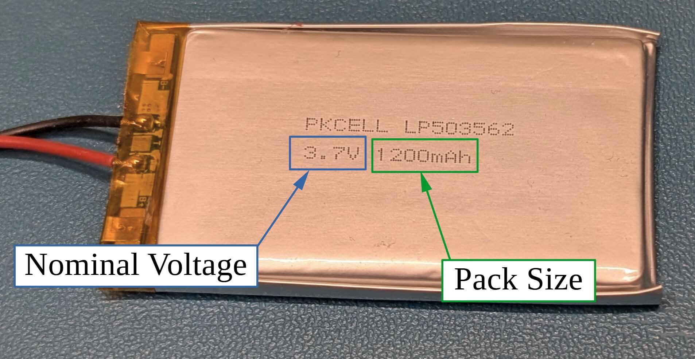
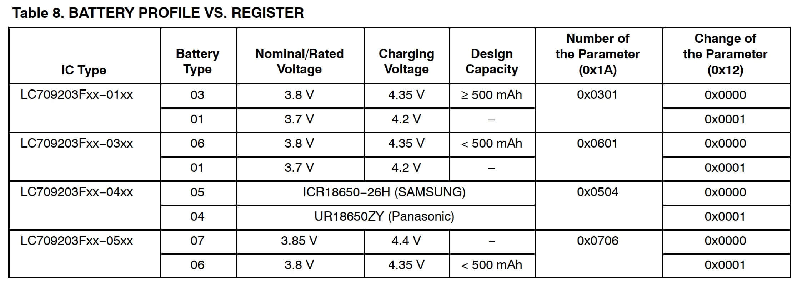
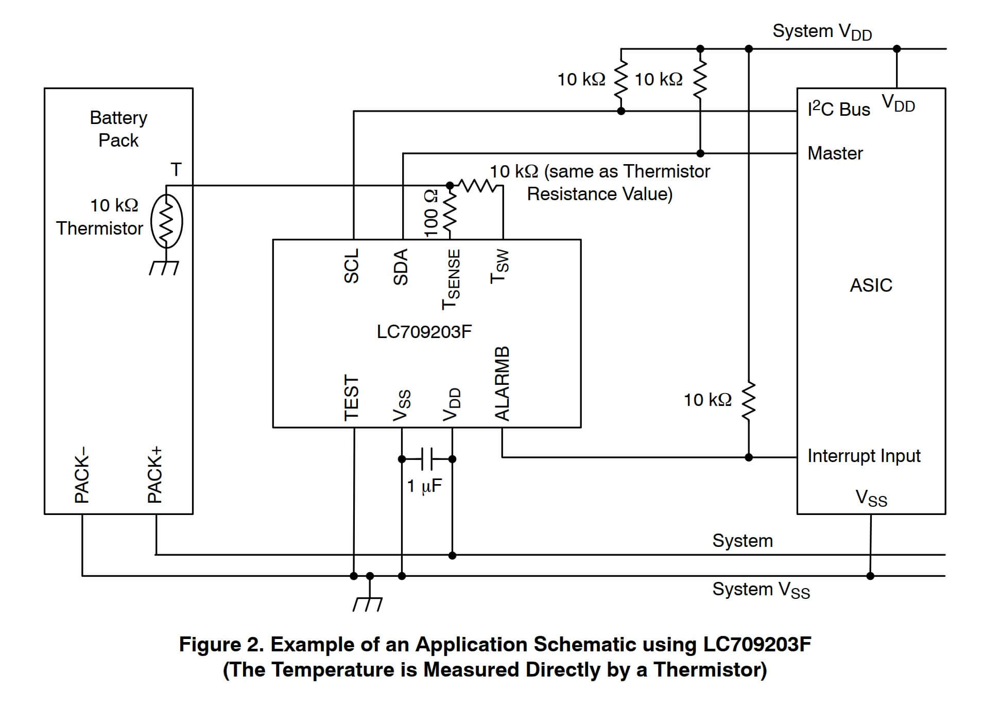

LC709203F Battery Monitor
===============================================

.. seo::
    :description: Instructions for setting up LC709203F battery monitor.
    :image: lc709203f.jpg
    :keywords: LC709203F

The ``lc709203f`` sensor platform allows you to use a LC709203F
(`datasheet <https://cdn-learn.adafruit.com/assets/assets/000/094/597/original/LC709203F-D.PDF>`__) 
battery monitor with ESPHome. This device is available as a 
`standalone sensor <https://www.adafruit.com/product/4712>`__ and it is also one of the battery
monitor chips used on the `ESP32 Feather <https://www.adafruit.com/product/5477>`__ dev boards.

.. note:: 

    This device does not contain a temperature sensor. Only enable the temperature sensor option 
    if you have attached a thermistor as shown in :ref:`temperature-sensor`.

.. code-block:: yaml

    # Example configuration entry
    sensor:
      - platform: lc709203f
        size: 2000
        voltage: 3.7
        battery_voltage:
          name: "Battery Voltage"
        battery_level:
          name: "Battery"
        temperature:
          name: "Pack Temperature"
          thermistor_b_constant: 0xA5A5

Configuration variables:
-----------------------------------------

- **size** (*Optional*): Size of the battery in mAH. 

  - Valid values are integers between 100 and 3000.
  - Defaults to 500 mAH; we highly recommend that this value is set as appropriate for your battery pack.
  - See :ref:`pack-size-and-voltage` for help if you don't know your pack size.
  
- **voltage** (*Optional*): nominal voltage of the battery pack in V.

  - Valid values are ``3.7`` or ``3.8``
  - Defaults to ``3.7``. This is the correct value for the Adafruit batteries.
  - See :ref:`pack-size-and-voltage` for help if you don't know your pack voltage.
  - See :ref:`pack-voltage` for more information on how this value is used.

- **battery_voltage** (*Optional*): Configuration for the voltage sensor. All options from :ref:`sensor <config-sensor>`.
  
- **battery_level** (*Optional*): Configuration for the battery level sensor. All options from :ref:`Sensor <config-sensor>`.

- **temperature** (*Optional*): Configuration for the battery temperature sensor.
  
  - **b_constant** (*Required*): The B-constant of the thermistor you are using.
  - All options from :ref:`Sensor <config-sensor>`.

- **update_interval** (*Optional*, :ref:`config-time`): The interval to check the
  sensor. Defaults to ``60s``.

Home Assistant View:
-----------------------------------------

When properly set up, the sensor will report values to Home Assistant as shown:

.. _pack-size-and-voltage:

Pack Size and Nominal Voltage
-----------------------------------------

The pack size and nominal voltage of your battery is typically printed on the battery as shown below.

.. _pack-voltage:

Pack Voltage
-----------------------------------------

You will need to configure your device with the correct nominal pack voltage. This
is used by the IC to improve the sensor's accuracy. The nominal voltage is used to set the 
``change of the parameter`` register per table 8 in the datasheet.

We assume that the device is a ``-01`` or ``-03`` device. This is the correct setup for the
Adafruit sensors and batteries.

.. _temperature-sensor:

Temperature Sensor Information
-----------------------------------------

If you want to measure temperature of the battery, you **must** have a thermistor attached to 
the device as shown in figure 2 of the datasheet.

Acknowledgments
---------------

Special thanks to the authors and contributors for the MAX17043 and BME680 sensor components
that I used extensively to learn how to create this component. Also, thanks to the authors of the `Adafruit LC709203F Arduino library <https://github.com/adafruit/Adafruit_LC709203F>`__ for example code showing how the communication and CRC calculations are done.
