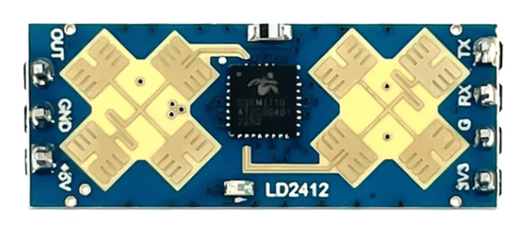

LD2412 Sensor
=============

.. seo::
    :description: Instructions for setting up LD2412 sensors for use with ESPHome.
    :image: ld2412.jpg

Component/Hub
-------------

The ``ld2412`` sensor platform allows you to use HI-LINK LD2412 motion and presence sensors with ESPHome.

The :ref:`UART <uart>` is required to be set up in your configuration for this sensor to work; ``parity`` and
``stop_bits`` **must be** respectively ``NONE`` and ``1``.

Use of a hardware UART is highly recommended as it best supports the default 115200 baud rate of the sensor module.

    LD2412 motion and presence sensor

.. code-block:: yaml

    # Example configuration entry
    ld2412:
      id: ld2412

Configuration variables:
************************

- **uart_id** (*Optional*, :ref:`config-id`): Manually specify the ID of the :ref:`UART Component <uart>`, which is
  necessary if you have multiple UARTs defined in your configuration.
- **id** (*Optional*, :ref:`config-id`): Manually specify the ID for this component.

Binary Sensor
-------------

The ``ld2412`` binary sensors allow you to quickly determine various states reported by the sensor.

.. code-block:: yaml

    binary_sensor:
      - platform: ld2412
        has_target:
          name: Presence
        has_moving_target:
          name: Moving Target
        has_still_target:
          name: Still Target
        dynamic_background_correction_status:
          name: Dynamic Background Correction Status

Configuration variables:
************************

- **has_target** (*Optional*): If true target detect either still or in movement.
  All options from :ref:`Binary Sensor <config-binary_sensor>`.
- **has_moving_target** (*Optional*): True if a moving target is detected.
  All options from :ref:`Binary Sensor <config-binary_sensor>`.
- **has_moving_target** (*Optional*): True if a moving target is detected.
  All options from :ref:`Binary Sensor <config-binary_sensor>`.
- **has_still_target** (*Optional*): True if a still target is detected.
  All options from :ref:`Binary Sensor <config-binary_sensor>`.
- **dynamic_background_correction_status** (*Optional*): True while a the dynamic background correction is in progress.
  All options from :ref:`Binary Sensor <config-binary_sensor>`.
- **ld2412_id** (*Optional*, :ref:`config-id`): Manually specify the ID for the component. Required when using multiple
  components.

.. note::

    By default, each of the target :doc:`Binary Sensor </components/binary_sensor/index>` components above includes the
    following :ref:`filter<binary_sensor-filters>` by default to prevent flooding Home Assistant with state updates:

    .. code-block:: yaml

        - settle: 1000ms

    If you have defined other filters, this default will be overridden; you may of course add it back to your custom
    filter(s) as above if you wish.

    To remove the default filter for a any given binary sensor instance, add ``filters: []`` to its configuration.

Sensor
------

The ``ld2412`` sensors allow reporting of various measurements the sensor takes.

.. code-block:: yaml

    sensor:
      - platform: ld2412
        moving_distance:
          name : Moving Distance
        still_distance:
          name: Still Distance
        moving_energy:
          name: Move Energy
        still_energy:
          name: Still Energy
        detection_distance:
          name: Detection Distance
        light:
            name: light
        gate_0:
          move_energy:
            name: Gate 0 move energy
          still_energy:
            name: Gate 0 still energy
        gate_1:
          move_energy:
            name: Gate 1 move energy
          still_energy:
            name: Gate 1 still energy
        gate_2:
          move_energy:
            name: Gate 2 move energy
          still_energy:
            name: Gate 2 still energy
        gate_3:
          move_energy:
            name: Gate 3 move energy
          still_energy:
            name: Gate 3 still energy
        gate_4:
          move_energy:
            name: Gate 4 move energy
          still_energy:
            name: Gate 4 still energy
        gate_5:
          move_energy:
            name: Gate 5 move energy
          still_energy:
            name: Gate 5 still energy
        gate_6:
          move_energy:
            name: Gate 6 move energy
          still_energy:
            name: Gate 6 still energy
        gate_7:
          move_energy:
            name: Gate 7 move energy
          still_energy:
            name: Gate 7 still energy
        gate_8:
          move_energy:
            name: Gate 8 move energy
          still_energy:
            name: Gate 8 still energy
        gate_9:
          move_energy:
            name: Gate 9 move energy
          still_energy:
            name: Gate 9 still energy
        gate_10:
          move_energy:
            name: Gate 10 move energy
          still_energy:
            name: Gate 10 still energy
        gate_11:
          move_energy:
            name: Gate 11 move energy
          still_energy:
            name: Gate 11 still energy
        gate_12:
          move_energy:
            name: Gate 12 move energy
          still_energy:
            name: Gate 12 still energy
        gate_13:
          move_energy:
            name: Gate 13 move energy
          still_energy:
            name: Gate 13 still energy

.. _ld2412-sensors:

Configuration variables:
************************

- **light** (*Optional*, int): When in :ref:`engineering mode<ld2412-engineering-mode>`, indicates the light
  sensitivity, otherwise indicates ``unknown``. Value between ``0`` and ``255`` inclusive. Note that this is an
  arbitrary unit and does not correspond to any particular unit of measurement for intensity. All options from
  :ref:`Sensor <config-sensor>`.
- **moving_distance** (*Optional*, int): Distance in cm of detected moving target. All options from
  :ref:`Sensor <config-sensor>`.
- **still_distance** (*Optional*, int): Distance in cm of detected still target. All options from
  :ref:`Sensor <config-sensor>`.
- **moving_energy** (*Optional*, int): Energy for moving target. Value between ``0`` and ``100`` inclusive. All options
  from :ref:`Sensor <config-sensor>`.
- **still_energy** (*Optional*, int): Energy for still target. Value between ``0`` and ``100`` inclusive. All options
  from :ref:`Sensor <config-sensor>`.
- **detection_distance** (*Optional*, int): Distance in cm of target. All options from :ref:`Sensor <config-sensor>`.
- **gate_X** (*Optional*): Energy values for gate X, where X is in the range of 0 to 13.

    - **move_energy** (*Optional*, int): When in :ref:`engineering mode<ld2412-engineering-mode>`, the move energy of
      the gate, otherwise indicates ``unknown``. Value between ``0`` and ``100`` inclusive. All options from
      :ref:`Sensor <config-sensor>`.
    - **still_energy** (*Optional*, int): When in :ref:`engineering mode<ld2412-engineering-mode>`, the still energy of
      the gate, otherwise indicates ``unknown``. Value between ``0`` and ``100`` inclusive. All options from
      :ref:`Sensor <config-sensor>`.

- **ld2412_id** (*Optional*, :ref:`config-id`): Manually specify the ID for the component. Required when using multiple
  components.

.. note::

    By default, each of the :doc:`Sensor </components/sensor/index>` components above includes the following
    :ref:`filter<sensor-filters>` by default to prevent flooding Home Assistant with state updates:

    .. code-block:: yaml

        - throttle_with_priority: 1000ms

    If you have defined other filters, this default will be overridden; you may of course add it back to your custom
    filter(s) as above if you wish.

    To remove the default filter for a any given sensor instance, add ``filters: []`` to its configuration.

Switch
------

The ``ld2412`` switches allow you to enable or disable sensor features from the front end.

.. code-block:: yaml

    switch:
      - platform: ld2412
        engineering_mode:
          name: Engineering Mode
        bluetooth:
          name: Bluetooth

.. _ld2412-engineering-mode:

Configuration variables:
************************

- **bluetooth** (*Optional*): Turn on/off the bluetooth adapter. Defaults to ``true``. All options from
  :ref:`Switch <config-switch>`.
- **engineering_mode** Turn on/off the engineering mode. All options from :ref:`Switch <config-switch>`.
- **ld2412_id** (*Optional*, :ref:`config-id`): Manually specify the ID for the component. Required when using multiple
  components.

.. _ld2412-number:

Number
------

The ``ld2412`` number allows you to control the configuration of your module.

.. code-block:: yaml

    number:
      - platform: ld2412
        timeout:
          name: Presence Timeout
        min_distance_gate:
          name: Minimum Distance Gate
        max_distance_gate:
          name: Maximum Distance Gate
        light_threshold:
          name: Light Threshold
        gate_0:
          move_threshold:
            name: Gate 0 Move Threshold
          still_threshold:
            name: Gate 0 Still Threshold
        gate_1:
          move_threshold:
            name: Gate 1 Move Threshold
          still_threshold:
            name: Gate 1 Still Threshold
        gate_2:
          move_threshold:
            name: Gate 2 Move Threshold
          still_threshold:
            name: Gate 2 Still Threshold
        gate_3:
          move_threshold:
            name: Gate 3 Move Threshold
          still_threshold:
            name: Gate 3 Still Threshold
        gate_4:
          move_threshold:
            name: Gate 4 Move Threshold
          still_threshold:
            name: Gate 4 Still Threshold
        gate_5:
          move_threshold:
            name: Gate 5 Move Threshold
          still_threshold:
            name: Gate 5 Still Threshold
        gate_6:
          move_threshold:
            name: Gate 6 Move Threshold
          still_threshold:
            name: Gate 6 Still Threshold
        gate_7:
          move_threshold:
            name: Gate 7 Move Threshold
          still_threshold:
            name: Gate 7 Still Threshold
        gate_8:
          move_threshold:
            name: Gate 8 Move Threshold
          still_threshold:
            name: Gate 8 Still Threshold
        gate_9:
          move_threshold:
            name: Gate 9 Move Threshold
          still_threshold:
            name: Gate 9 Still Threshold
        gate_10:
          move_threshold:
            name: Gate 10 Move Threshold
          still_threshold:
            name: Gate 10 Still Threshold
        gate_11:
          move_threshold:
            name: Gate 11 Move Threshold
          still_threshold:
            name: Gate 11 Still Threshold
        gate_12:
          move_threshold:
            name: Gate 12 Move Threshold
          still_threshold:
            name: Gate 12 Still Threshold
        gate_13:
          move_threshold:
            name: Gate 13 Move Threshold
          still_threshold:
            name: Gate 13 Still Threshold

Configuration variables:
************************

- **timeout** (*Optional*, int): Time in seconds for which the presence state will remain after presence is no longer
  detected. Defaults to ``5s``. All options from :ref:`Number <config-number>`.
- **min_distance_gate** (*Optional*, int): Maximum distance gate for movement detection. Value between ``1`` and ``12``
  inclusive. Defaults to ``1``. All options from :ref:`Number <config-number>`.
- **max_distance_gate** (*Optional*, int): Maximum distance gate for still detection. Value between ``2`` and ``13``
  inclusive. Defaults to ``13``. All options from :ref:`Number <config-number>`.
- **light_threshold** (*Optional*, int): Threshold for the light to activate the OUT pin of the sensor. All options
  from :ref:`Number <config-number>`.
- **gate_X** (*Optional*): Threshold values for gate X, where X is in the range of 0 to 13.

    - **move_threshold** (**Required**, int): Threshold for the gate for motion detection. For the respective gate, a
      value above this level will result in detection of movement. Value between ``0`` and ``100`` inclusive. See
      default values below. All options from :ref:`Number <config-number>`.
    - **still_threshold** (**Required**, int): Threshold for the gate for still detection. For the respective gate, a
      value below this level will result in detection of stillness. Value between ``0`` and ``100`` inclusive. See
      default values below. All options from :ref:`Number <config-number>`.

- **ld2412_id** (*Optional*, :ref:`config-id`): Manually specify the ID for the component. Required when using multiple
  components.

Button
------

The ``ld2412`` button allows you to perform actions on your sensor.

.. code-block:: yaml

    button:
      - platform: ld2412
        factory_reset:
          name: Factory Reset
        restart:
          name: Restart
        query_params:
          name: Query Params
        start_dynamic_background_correction:
          name: Start Dynamic Background Correction

Configuration variables:
************************

- **factory_reset** (*Optional*): This command is used to restore all configuration values to their original values.
  All options from :ref:`Button <config-button>`.
- **restart** (*Optional*): Restart the device. All options from :ref:`Button <config-button>`.
- **query_params** (*Optional*): Refresh all sensors values of the device. All options from
  :ref:`Button <config-button>`.
- **start_dynamic_background_correction** (*Optional*): Start the Dynamic Background Correction All options from
  :ref:`Button <config-button>`.
- **ld2412_id** (*Optional*, :ref:`config-id`): Manually specify the ID for the component. Required when using multiple
  components.

Text Sensor
-----------

The ``ld2412`` text sensors allow reporting of sensor metadata.

.. code-block:: yaml

    text_sensor:
      - platform: ld2412
        version:
          name: Firmware Version
        mac_address:
          name: Mac Address

Configuration variables:
************************

- **version** (*Optional*): The firmware version. All options from :ref:`Text Sensor <config-text_sensor>`.
- **mac_address** (*Optional*): The bluetooth mac address. Will be set to ``unknown`` when bluetooth is off. All
  options from :ref:`Text Sensor <config-text_sensor>`.
- **ld2412_id** (*Optional*, :ref:`config-id`): Manually specify the ID for the component. Required when using multiple
  components.

Select
------

The ``ld2412`` selects allow you to configure your sensor hardware.

.. code-block:: yaml

    select:
      - platform: ld2412
        out_pin_level:
          name: Hardware Output Pin Level
        distance_resolution:
          name: Distance Resolution
        light_function:
          name: Light Function
        baud_rate:
          name: Baud Rate

.. _ld2412-light-function:

Configuration variables:
************************

- **distance_resolution** (*Optional*): Control the gates distance resolution. Can be ``0.75m``, ``0.5m`` or ``0.2m``.
  Defaults to ``0.75m``. All options from :ref:`Select <config-select>`.
- **baud_rate** (*Optional*): Allows changing the baud rate of the LD2412's serial port. Defaults to ``115200``. Once
  changed, sensors will stop working until the :ref:`UART Component <uart>` is updated with the new baud rate in your
  device's configuration. All options from :ref:`Select <config-select>`.
- **out_pin_level** (*Optional*): Allows selection of the LD2412's OUT pin behavior when the sensor detects presence.
  Can be ``low`` or ``high``. Defaults to ``low``. All options from :ref:`Select <config-select>`.
- **light_function** (*Optional*): Allows selection of how the LD2412's OUT pin will react to the light level. Can be
  ``off``, ``below`` or ``above``. Note that this works in conjunction with presence detection. See the reference
  manual for details.
- **ld2412_id** (*Optional*, :ref:`config-id`): Manually specify the ID for the component. Required when using multiple
  components.

OUT pin
-------

The LD2412's ``OUT`` pin provides a simple hardware mechanism which reports whether the sensor detects presence (and
light) or not. If you wish, you can set up a :ref:`GPIO Binary Sensor <gpio-binary-sensor>`:

.. code-block:: yaml

    binary_sensor:
      - platform: gpio
        pin: GPIOXX
        name: LD2412 Out Pin Status
        device_class: presence

Calibration Process
-------------------

To calibrate your sensor, perform the following:

1. Enable :ref:`engineering mode<ld2412-engineering-mode>`.
2. Monitor the ``gate_X_move_energy`` and ``gate_X_still_energy`` :ref:`sensors<ld2412-sensors>`.
3. Change the :ref:`thresholds<ld2412-number>` and repeat step 2 until you are satisfied.
4. Disable :ref:`engineering mode<ld2412-engineering-mode>`.

As an alternative, you can simply leave the room, turn on the "Dynamic background correction" and let it calibrate
itself.

See Also
--------

- `Official Datasheet and user manuals <https://h.hlktech.com/Mobile/download/fdetail/296.html>`_
- `Source of inspiration for implementation <community.home-assistant.io/t/diy-human-sensor-l12-base-on-hlk-ld2412/758421/68>`_
- :apiref:`ld2412/ld2412.h`
- :ghedit:`Edit`
